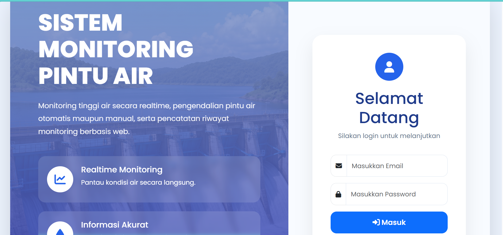
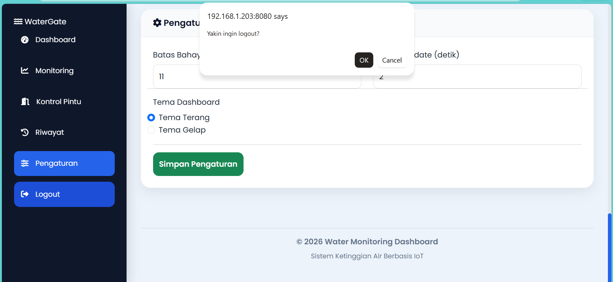
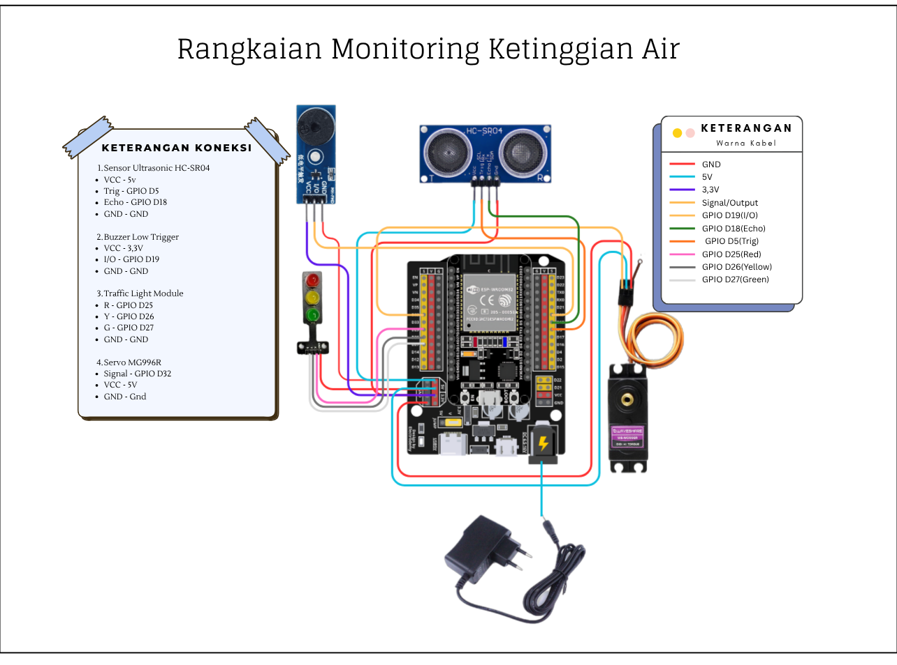
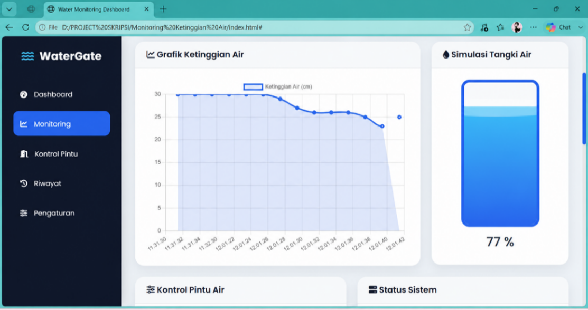
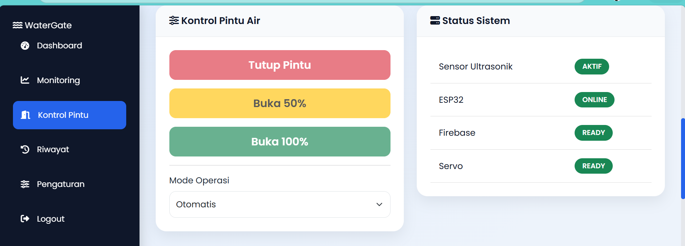
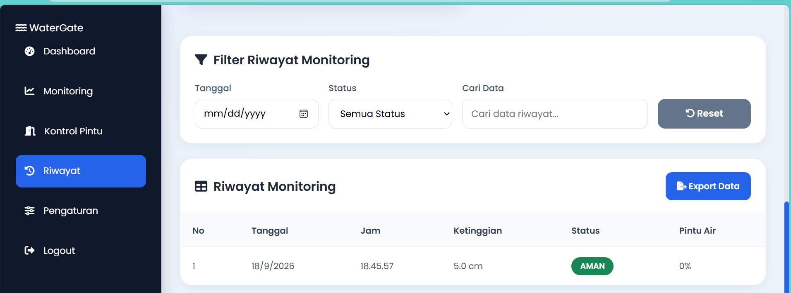
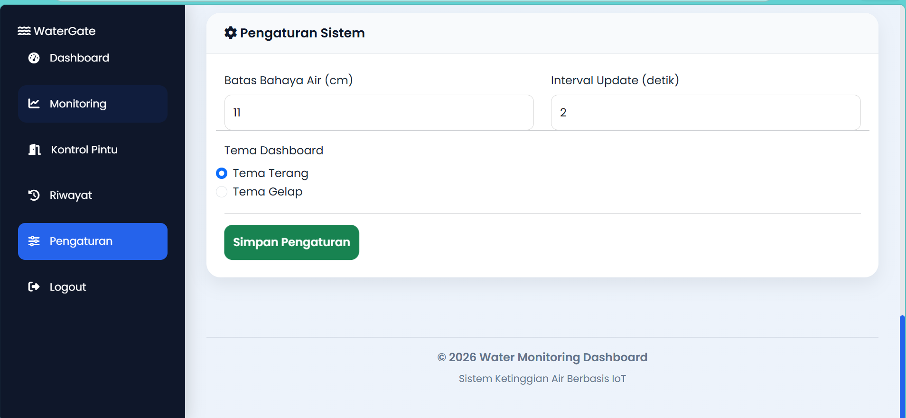

# Prototype Monitoring Ketinggian Air

## 📌 Deskripsi
Monitoring Ketinggian Air Berbasis IoT merupakan sebuah sistem yang dirancang untuk melakukan pemantauan ketinggian air secara real-time dengan memanfaatkan teknologi Internet of Things (IoT). Sistem ini menggunakan sensor untuk mengukur ketinggian air, kemudian data hasil pengukuran diproses dan dikirimkan ke sistem monitoring sehingga dapat dipantau melalui dashboard.

Project ini bertujuan untuk memberikan informasi mengenai kondisi ketinggian air secara cepat dan mudah, sehingga pengguna dapat mengetahui perubahan ketinggian air tanpa harus melakukan pengukuran secara manual.

Data ketinggian air yang diperoleh dari sensor ditampilkan pada dashboard dalam bentuk informasi nilai ketinggian dan status kondisi air. Dengan adanya sistem berbasis IoT ini, proses pemantauan dapat dilakukan secara lebih praktis dan dapat mendukung pengambilan tindakan ketika ketinggian air mencapai kondisi tertentu.

## 🛠️ Teknologi
- HC-SR04 → membaca ketinggian air
- ESP32 → memproses data dan menjadi penghubung hardware dengan internet
- Wi-Fi → mengirimkan data melalui internet
- Firebase Realtime Database → menyimpan dan menyediakan data secara real-time
- Web dashboard → menampilkan kondisi air kepada admin
- Servo MG996R → menggerakkan pintu air
- Traffic light module → indikator kondisi aman, siaga, dan bahaya
- Buzzer → memberikan peringatan ketika kondisi air berbahaya
  
## ⚙️ Cara Kerja
Sistem monitoring ketinggian air ini bekerja dengan memanfaatkan sensor ultrasonik HC-SR04, mikrokontroler ESP32, koneksi internet, Firebase Realtime Database, dan web dashboard.

Proses dimulai ketika sensor ultrasonik HC-SR04 melakukan pembacaan terhadap permukaan air secara berkala. Hasil pembacaan sensor kemudian dikirimkan ke ESP32 untuk diproses menjadi informasi ketinggian air. ESP32 selanjutnya menggunakan koneksi Wi-Fi untuk mengirimkan data tersebut ke Firebase Realtime Database.

Firebase berfungsi sebagai media penyimpanan sekaligus penghubung antara perangkat ESP32 dengan web dashboard. Data yang telah tersimpan di Firebase dapat diakses oleh dashboard sehingga admin dapat melihat kondisi ketinggian air secara real-time. Selain menampilkan kondisi air saat ini, data monitoring yang telah disimpan juga dapat ditampilkan kembali dalam bentuk riwayat monitoring, sehingga admin dapat melihat data pengukuran sebelumnya berdasarkan waktu pencatatan dan bisa diekspor ke file exel, sehingga dapat menjadi bahan evaluasi.

Pada dashboard, informasi yang ditampilkan meliputi nilai ketinggian air, status kondisi air, kondisi pintu air, grafik ketinggian air, waktu monitoring, serta status beberapa komponen sistem. Kondisi ketinggian air dikategorikan menjadi aman, siaga, dan bahaya. Dashboard juga menyediakan fitur riwayat yang berisi data hasil monitoring yang telah tersimpan, sehingga data dapat digunakan untuk melihat perubahan kondisi ketinggian air dari waktu ke waktu dan sebagai bahan evaluasi sistem.

Selain melakukan monitoring, sistem juga memiliki fungsi pengendalian pintu air. Admin dapat memberikan perintah untuk membuka atau menutup pintu melalui dashboard. Perintah tersebut dikirim ke Firebase dan kemudian diteruskan ke ESP32. ESP32 akan mengendalikan servo MG996R untuk menggerakkan pintu air sesuai dengan perintah yang diterima.

Sebagai indikator kondisi pada prototype, traffic light module digunakan untuk menunjukkan kondisi aman, siaga, dan bahaya. Ketika kondisi air mencapai batas berbahaya, ESP32 juga mengaktifkan buzzer sebagai peringatan suara.

Dengan demikian, sistem membentuk suatu alur IoT yang menghubungkan sensor, ESP32, jaringan internet, Firebase, dashboard, dan aktuator. Data dari lingkungan dapat dipantau secara real-time melalui dashboard, sedangkan data hasil monitoring juga disimpan sehingga dapat dilihat kembali melalui fitur riwayat. Selain itu, pintu air dapat dikendalikan melalui sistem secara jarak jauh.

## 📸 Dokumentasi

## 👩‍💻 Author
Natasya Andryana Saputri